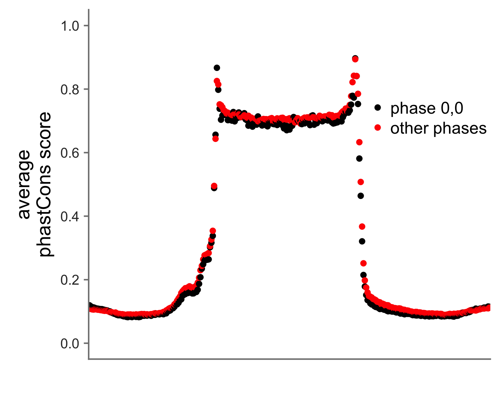
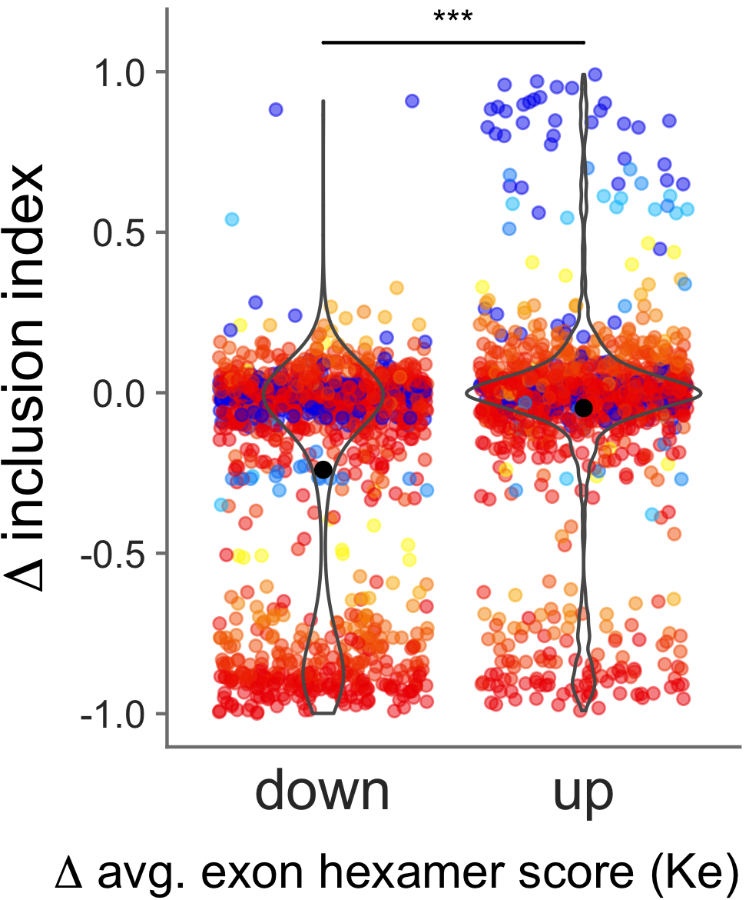

# Supplementary Figures - Computational #

#### Is there a difference in conservation between our short intron context (~30bp) and longer 100bp intron context? ####

#### How many exons are in-frame (phase 0,0) vs. out-of-frame? ####

#### Is there a difference in conservation between exons in-frame vs. exons out-of-frame? ####

#### What is the distribution of all genomic SNVs between exons and introns? ####

#### How are other measures of exonic strength distributed in our assay? ####

