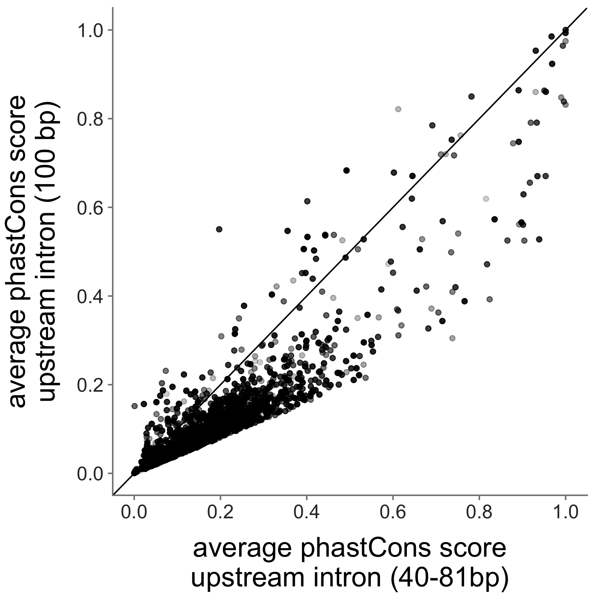
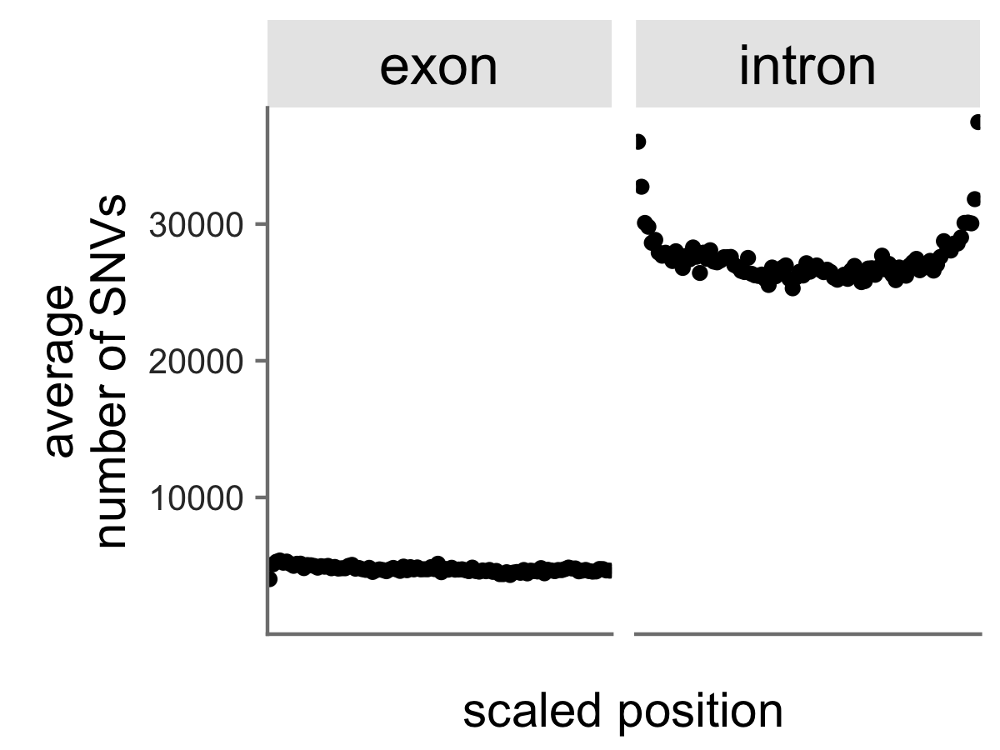

# Supplementary Figures - Computational #

#### Is there a difference in conservation between our short intron context (~30bp) and longer 100bp intron context? ####

####Is there a difference in conservation between exons in-frame vs. exons out-of-frame?####

####What is the distribution of all genomic SNVs between exons and introns?####

####How are other measures of exonic strength distributed in our assay?####

